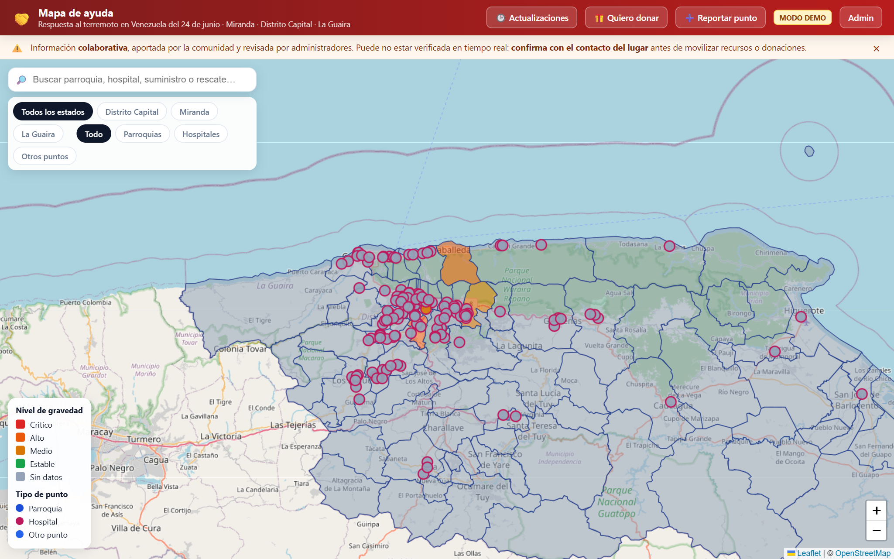
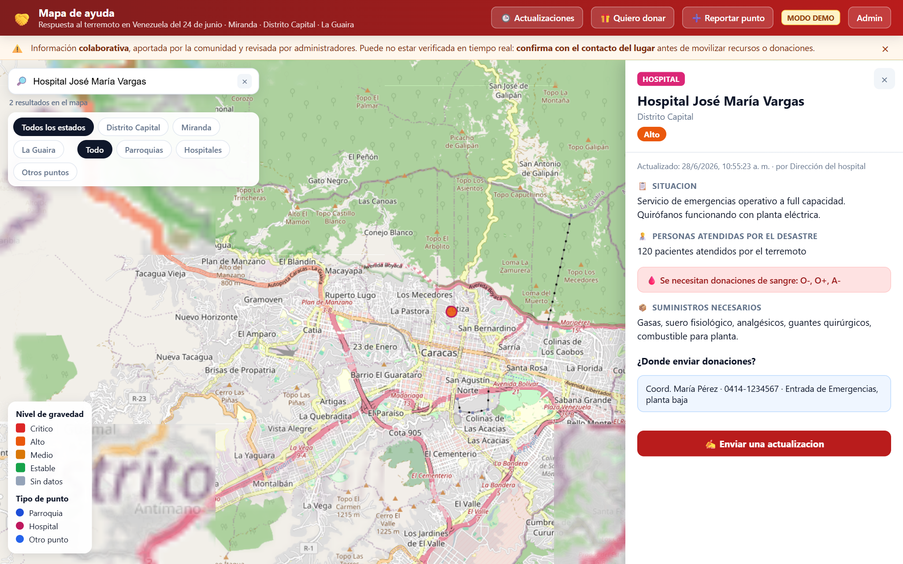
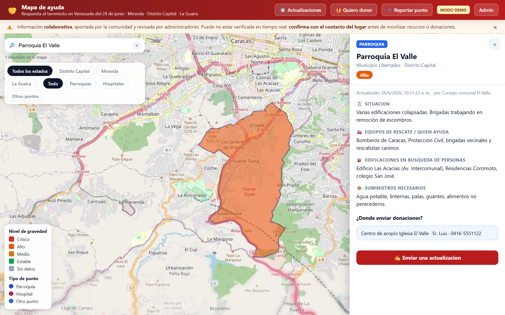
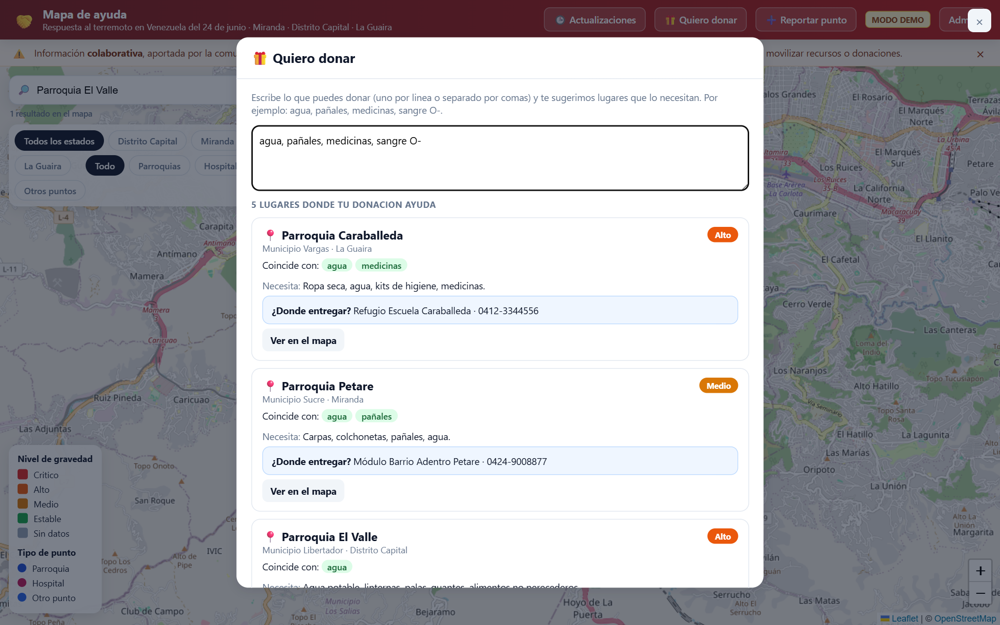
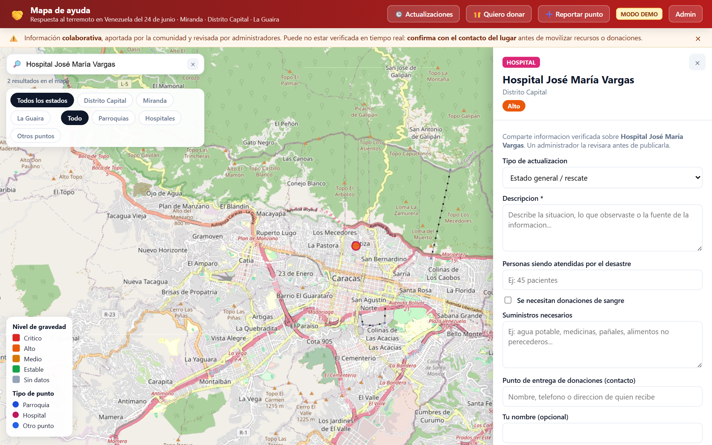
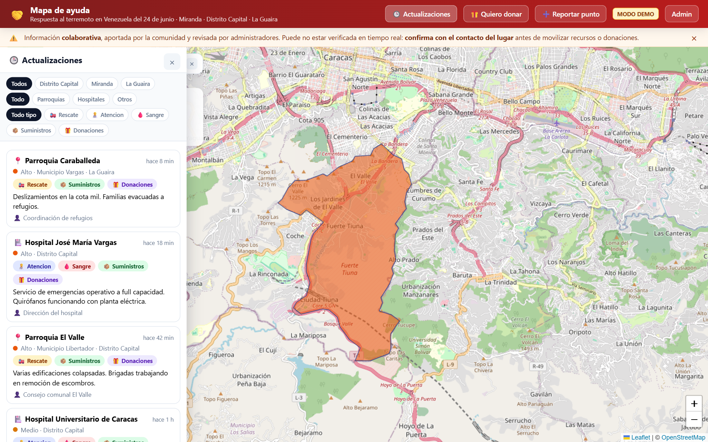
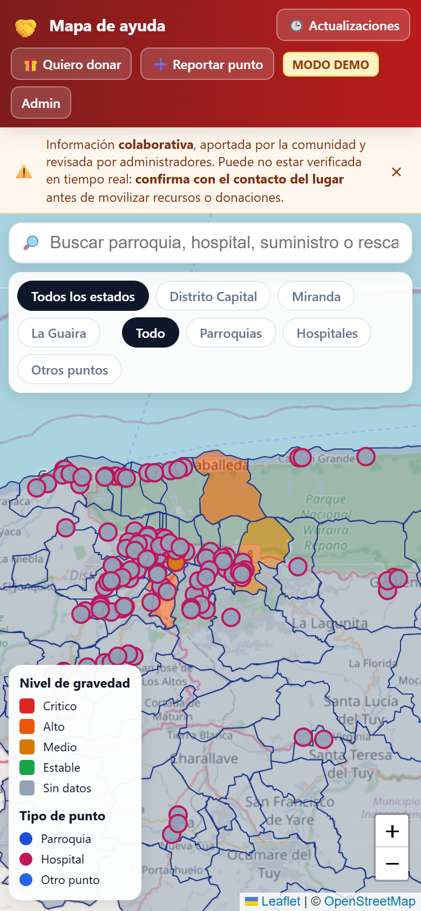

# Mapa de Ayuda — Capturas para promoción

Imágenes para difundir el sitio entre donantes, voluntarios y aliados.
Sitio en producción: **https://cdifino.github.io/unamanovzla/**

> Las capturas se generaron con datos de ejemplo (modo demo) para ilustrar las
> funciones. Para regenerarlas: `node scripts/screenshots.mjs` (con el preview
> demo corriendo en el puerto 4174).

| Captura | Función | Cómo describirla al promocionar |
| --- | --- | --- |
|  | **Mapa interactivo** de Miranda, Distrito Capital y La Guaira con parroquias y hospitales, coloreados por nivel de gravedad. | "Mirá en un solo mapa dónde se está ayudando y qué hace falta." |
|  | **Ficha de un hospital**: personas atendidas, necesidad de sangre, suministros y a dónde enviar donaciones. | "Cada hospital muestra qué necesita y dónde entregar tu aporte." |
|  | **Ficha de una parroquia**: equipos de rescate, edificaciones en búsqueda, suministros y punto de entrega. | "Enterate de quién está rescatando y qué se necesita en cada zona." |
|  | **Asistente "Quiero donar"**: escribís lo que podés donar y te sugiere los lugares que lo necesitan. | "Decinos qué podés donar y te decimos exactamente a dónde llevarlo." |
|  | **Formulario de reporte** abierto a cualquiera; un administrador lo revisa antes de publicar. | "¿Tenés información de la zona? Reportala en segundos." |
|  | **Línea de tiempo** con las últimas actualizaciones, ordenadas por fecha y filtrables por estado y tipo. | "Seguí en vivo lo más reciente de cada punto." |
|  | **Diseño responsive**: funciona cómodo desde el teléfono. | "Úsalo desde tu celular, donde estés." |

## Mensaje sugerido para redes

> 🤝 **Mapa de Ayuda — Terremoto del 24 de junio**
> Un mapa colaborativo de Miranda, Distrito Capital y La Guaira para coordinar
> la ayuda: mirá qué necesita cada hospital y parroquia, y a dónde llevar tus
> donaciones. ¿Querés donar? El sitio te dice exactamente dónde hace falta.
> 👉 https://cdifino.github.io/unamanovzla/
